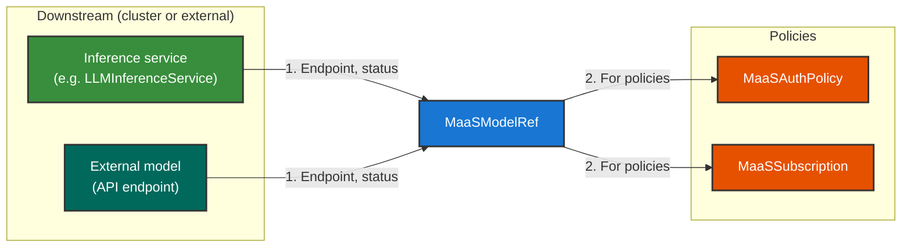

# Model Reference

**MaaSModelRef** is a pointer to an **inference service** (on-cluster or external). 

The controller **collects metadata** from that service and uses it to **wire routing on the default gateway** (`maas-default-gateway`). **MaaSAuthPolicy** and **MaaSSubscription** reference the same `MaaSModelRef` names so **access** and **quota** apply on the inference path.

For configuration steps, see [Quota and Access Configuration](../configuration-and-management/quota-and-access-configuration.md).
