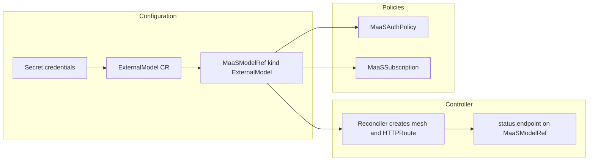

# External models

!!! warning "Documentation in progress"
    This section is **still under development**. Behavior, field names, and operator steps may change in upcoming releases. For authoritative CRD fields, see the **[ExternalModel](../reference/crds/external-model.md)** reference. For registration steps aligned with the API, see [Registering external models](model-listing-flow.md#registering-external-models).

**External models** are inference backends that run **outside** the cluster (for example managed APIs or a reachable HTTP endpoint). In MaaS they are still represented by a **MaaSModelRef** with **`spec.modelRef.kind: ExternalModel`**, so listing, API keys, subscriptions, and gateway policies work the same way as for on-cluster models—the difference is how traffic is routed to the upstream provider.

## Flow (high level)

1. **Provider configuration** — You define an **[ExternalModel](../reference/crds/external-model.md)** CR in the model namespace: `provider`, `endpoint` (FQDN), `credentialRef` (Secret with API keys), and `targetModel` (upstream model id). The Secret must live in the **same namespace** as the ExternalModel and the MaaSModelRef you will create.

2. **Registration** — You create a **MaaSModelRef** whose **`spec.modelRef.name`** matches the ExternalModel’s name (same namespace). The MaaS controller treats this as an external backend.

3. **Route and mesh** — The **ExternalModel** reconciler creates namespaced resources so traffic can leave the mesh to the provider: an ExternalName **Service**, Istio **ServiceEntry**, optional **DestinationRule** (TLS origination), and a Gateway API **HTTPRoute** attached to **`maas-default-gateway`**. Those objects are **owned by the ExternalModel** CR (not by the MaaSModelRef name).

### HTTPRoute name: one route per ExternalModel

The **HTTPRoute** `metadata.name` is the **ExternalModel** name (the same string as **`spec.modelRef.name`** on the `MaaSModelRef`). It is **not** the `MaaSModelRef`’s own `metadata.name`, so you can name the model reference `maas-model-my-model` while the ExternalModel (and its HTTPRoute) stay `my-model`.

If you see **two** HTTPRoutes (for example `my-model` and `maas-model-my-model`), only **`my-model`** is created by the ExternalModel flow in this project. A route whose name matches the **MaaSModelRef** name is usually from **KServe** (an `LLMInferenceService` / `InferenceService` with that name), an old experiment, or a manually applied manifest—not from the ExternalModel reconciler.

4. **Status** — The **MaaSModelRef** reconciler waits until the HTTPRoute is **Accepted** and **Programmed** on the gateway, then sets **`status.endpoint`** to the **client-facing MaaS URL** (not the raw provider URL). Clients and **`GET /v1/models`** both use that URL.

5. **Access and quota** — You apply **MaaSAuthPolicy** and **MaaSSubscription** the same way as for on-cluster models.

## Related documentation

- [MaaSModelRef kinds — ExternalModel](maas-model-kinds.md#externalmodel) — reconciler responsibilities and optional annotations
- [Model listing flow — Registering external models](model-listing-flow.md#registering-external-models) — numbered steps and catalog behavior
- [On-cluster models](model-gateway-and-serving.md) — LLMInferenceService and `maas-default-gateway` (contrast with external routing)
