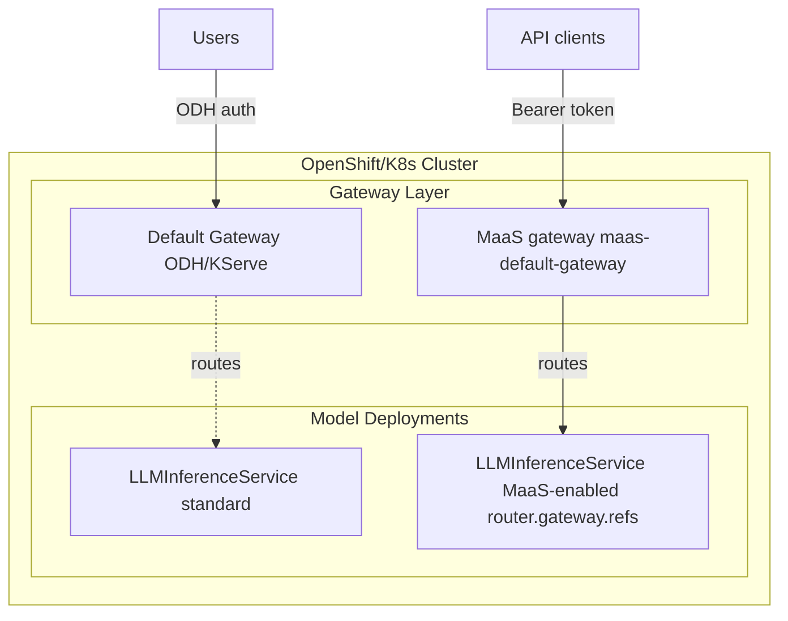

# On-cluster models

This page covers **on-cluster models**: point an **LLMInferenceService** at **`maas-default-gateway`** so traffic uses MaaS authentication, subscriptions, and rate limits. For end-to-end samples (LLMInferenceService + MaaSModelRef + policies), see [Deploy sample models](../install/model-setup.md).

**Related topics (canonical detail elsewhere):**

- Catalog and **`GET /v1/models`** behavior: [Model listing flow](model-listing-flow.md)
- **`spec.modelRef` kinds** (`LLMInferenceService`, `ExternalModel`): [MaaSModelRef kinds](maas-model-kinds.md)
- Access and quotas: [Quota and Access Configuration](quota-and-access-configuration.md)

!!! tip "Subscription model"
    Model access and rate limits use **MaaSModelRef**, **MaaSAuthPolicy**, and **MaaSSubscription**. See [Access and Quota Overview](../concepts/subscription-overview.md).

## Backends at a glance

On-cluster models typically use **LLMInferenceService** (for example vLLM via KServe). For **off-cluster** providers, see [External models](external-models.md). See [MaaSModelRef kinds](maas-model-kinds.md) for field semantics.

## Standard vs MaaS gateway

MaaS uses a **separate** Gateway API instance for policy enforcement. Only workloads attached to **`maas-default-gateway`** participate in MaaS listing (via **MaaSModelRef**), API keys, and subscription limits. The default KServe/ODH gateway path does not apply those policies.

The diagram summarizes the split; for platform-wide context see [Architecture](../concepts/architecture.md).



!!! note
    **`maas-default-gateway`** is created during MaaS installation; you do not create it by hand for normal setups.

## Prerequisites

- MaaS installed with **`maas-default-gateway`**
- An **LLMInferenceService** to configure (or plan to create one)
- Permissions to edit **LLMInferenceService** in the target namespace

## Configure the gateway reference

Set **`spec.router.gateway.refs`** so the inference route attaches to **`maas-default-gateway`** in **`openshift-ingress`**. Without this, KServe uses the default gateway and **MaaS policies do not apply**.

```yaml
apiVersion: serving.kserve.io/v1alpha1
kind: LLMInferenceService
metadata:
  name: my-production-model
  namespace: llm
spec:
  model:
    uri: hf://Qwen/Qwen3-0.6B
    name: Qwen/Qwen3-0.6B
  replicas: 1
  router:
    route: { }
    gateway:
      refs:
        - name: maas-default-gateway
          namespace: openshift-ingress
  template:
    # ... your container / resources ...
```

GPU, image, and resource blocks vary by model; see [Deploy sample models](../install/model-setup.md) for full samples.

!!! warning "Legacy tier annotation"
    The annotation **`alpha.maas.opendatahub.io/tiers`** applied to **LLMInferenceService** was part of the **legacy tier-based** access model (automatic tier RBAC). Current deployments should use **MaaSSubscription** and **MaaSAuthPolicy** instead. If you still maintain tier annotations, see [Tier to Subscription migration](../migration/tier-to-subscription.md).

## MaaSModelRef metadata (optional)

After the LLMInferenceService uses the MaaS gateway, register it with a **MaaSModelRef** and optional display annotations for **`GET /v1/models`**. See [CRD annotations](crd-annotations.md) for the full list.

```yaml
apiVersion: maas.opendatahub.io/v1alpha1
kind: MaaSModelRef
metadata:
  name: my-production-model
  namespace: llm
  annotations:
    openshift.io/display-name: "My Production Model"
spec:
  modelRef:
    kind: LLMInferenceService
    name: my-production-model
```

## Update an existing LLMInferenceService

**Patch:**

```bash
kubectl patch llminferenceservice my-production-model -n llm --type='json' -p='[
  {
    "op": "add",
    "path": "/spec/router/gateway/refs/-",
    "value": {
      "name": "maas-default-gateway",
      "namespace": "openshift-ingress"
    }
  }
]'
```

Or **`kubectl edit llminferenceservice my-production-model -n llm`** and set **`spec.router.gateway.refs`** as in the YAML above.
