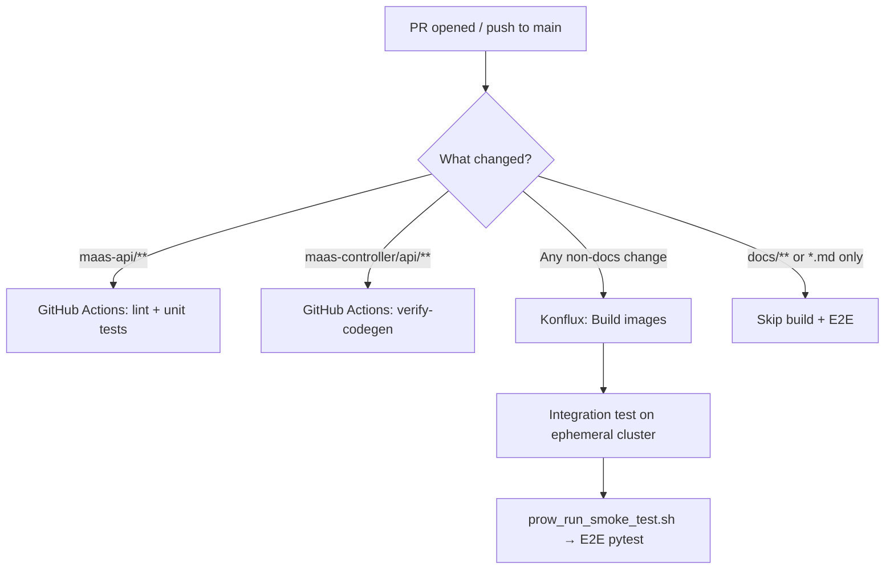

# MaaS Testing and Contribution Guide

This guide covers what tests exist in the MaaS project, how to run them, and how to add new tests when contributing a feature or fix.

## Test Overview

| Type | Location | Language | Runner |
|------|----------|----------|--------|
| **Unit tests** | `maas-api/internal/`, `maas-api/cmd/` | Go | `make test` |
| **Unit tests** | `maas-controller/pkg/` | Go | `make test` |
| **E2E tests** | `test/e2e/tests/` | Python (pytest) | `run-tests-quick.sh`, `smoke.sh` |
| **CI smoke / E2E** | `test/e2e/scripts/prow_run_smoke_test.sh` | Bash + pytest | Konflux integration |
| **Integration tests** | [opendatahub-tests](https://github.com/opendatahub-io/opendatahub-tests) | Python (pytest) | ODH CI / Nightly |

### Repository Structure (Testing)

```
maas-api/
├── internal/**/*_test.go        # Unit tests for API handlers, services, auth
├── cmd/*_test.go                # Unit tests for CLI/server setup
└── test/fixtures/               # Shared Go test helpers (fakes, test data)

maas-controller/
└── pkg/**/*_test.go             # Unit tests for CRD reconcilers

test/e2e/
├── tests/                       # Pytest E2E test modules
│   ├── conftest.py              # Shared session-scoped fixtures
│   └── test_*.py                # Test modules (see table below)
├── fixtures/                    # Kustomize overlays for test CRs
├── scripts/prow_run_smoke_test.sh  # Full deploy + E2E (CI entrypoint)
├── smoke.sh                     # Run all E2E modules locally
├── run-tests-quick.sh           # Quick pytest run (no deploy)
└── requirements.txt             # Python dependencies
```

### E2E Test Modules

| Module | What it covers |
|--------|---------------|
| `test_smoke.py` | Health checks, catalog shape, basic inference |
| `test_api_keys.py` | API key CRUD, admin authorization, validation |
| `test_subscription.py` | Subscription enforcement, rate limiting, auth flows |
| `test_subscription_list_endpoints.py` | Subscription listing endpoints |
| `test_models_endpoint.py` | `/v1/models` subscription-aware filtering |
| `test_namespace_scoping.py` | Namespace isolation behavior |
| `test_external_oidc.py` | External OIDC token flows (skipped unless `EXTERNAL_OIDC=true`) |

## Running Tests

### Unit Tests (Go)

=== "maas-api"

    ```bash
    cd maas-api
    make test    # runs go test with race detection + coverage
    make lint    # golangci-lint
    ```

=== "maas-controller"

    ```bash
    cd maas-controller
    make test    # runs go test with race detection + coverage
    make lint    # golangci-lint
    ```

Both generate a `coverage.html` report in their respective directories.

### E2E Tests (Python)

!!! note "Prerequisites"
    OpenShift cluster with MaaS deployed, `oc` logged in as cluster-admin, Python 3.9+.

=== "Quick (local dev)"

    ```bash
    # Cluster must already have MaaS deployed
    ./test/e2e/run-tests-quick.sh

    # Run specific file or filter
    ./test/e2e/run-tests-quick.sh tests/test_api_keys.py
    ./test/e2e/run-tests-quick.sh -k test_create_api_key
    ```

=== "Smoke (all modules)"

    ```bash
    ./test/e2e/smoke.sh
    ```

=== "Full CI (deploy + test)"

    ```bash
    # Deploys the full platform, models, fixtures, then runs E2E
    ./test/e2e/scripts/prow_run_smoke_test.sh

    # Skip deploy if cluster is already set up
    SKIP_DEPLOYMENT=true ./test/e2e/scripts/prow_run_smoke_test.sh
    ```

=== "Direct pytest"

    ```bash
    cd test/e2e
    python3 -m venv .venv && source .venv/bin/activate
    pip install -r requirements.txt

    export GATEWAY_HOST="maas.apps.your-cluster.example.com"
    export E2E_SKIP_TLS_VERIFY=true

    pytest tests/ -v                                    # all tests
    pytest tests/test_subscription.py -v                # one module
    pytest tests/test_api_keys.py::TestAPIKeyCreation -v  # one class
    ```

### Key Environment Variables

The E2E framework auto-discovers most values from the cluster. These are the most common overrides:

| Variable | Description |
|----------|-------------|
| `GATEWAY_HOST` | Gateway hostname (required unless `MAAS_API_BASE_URL` is set) |
| `MAAS_API_BASE_URL` | Full MaaS API URL (auto-derived if not set) |
| `TOKEN` | User bearer token (falls back to `oc whoami -t`) |
| `ADMIN_OC_TOKEN` | Admin token; admin tests skip if unset |
| `E2E_SKIP_TLS_VERIFY` | Set `true` to skip TLS verification |
| `MODEL_NAME` | Override model ID (defaults to first from catalog) |
| `EXTERNAL_OIDC` | Set `true` to enable external OIDC tests |

See `test/e2e/tests/conftest.py` and individual test module docstrings for the full set of supported variables.

## CI Pipeline

CI runs automatically on every PR and push to `main`. Here's how the different test types fit together:



| System | Trigger | What runs |
|--------|---------|-----------|
| **GitHub Actions** | `maas-api/**` changes | golangci-lint, `make test` (Go unit tests), image build |
| **GitHub Actions** | `maas-controller/api/**` or `deployment/**` changes | `make verify-codegen`, kustomize manifest validation |
| **Konflux** | Any non-docs PR or push to `main` | Builds multi-arch images, then runs full E2E on an ephemeral OpenShift cluster |

Konflux provisions a fresh cluster, deploys ODH + MaaS with the PR's built images, and runs `test/e2e/scripts/prow_run_smoke_test.sh`. Nightly builds use the same script against the latest `main` images — there is no separate nightly test suite.

!!! tip "Docs-only changes"
    PRs that only touch `docs/**` or `*.md` files skip Konflux builds and E2E entirely (controlled via CEL expressions in `.tekton/` pipeline definitions).

## Adding New Tests

### Adding a Go Unit Test

1. Create a `*_test.go` file next to the code you're testing (standard Go convention)
2. Use `testify/assert` and `testify/require` for assertions
3. For `maas-api` handlers: use `net/http/httptest` and the fake listers in `maas-api/test/fixtures/`
4. For `maas-controller` reconcilers: use `controller-runtime/pkg/client/fake` with scheme setup
5. Run `make test` in the relevant directory to verify

**Quick reference** — a minimal handler test in `maas-api`:

```go
func TestMyHandler_Returns200(t *testing.T) {
    req := httptest.NewRequest(http.MethodGet, "/v1/my-endpoint", nil)
    rec := httptest.NewRecorder()
    handler := NewMyHandler(/* fake dependencies */)

    handler.ServeHTTP(rec, req)

    require.Equal(t, http.StatusOK, rec.Code)
}
```

**Quick reference** — a minimal reconciler test in `maas-controller`:

```go
func TestMyReconciler_Succeeds(t *testing.T) {
    client := fake.NewClientBuilder().WithScheme(scheme).WithObjects(/* seed */).Build()
    r := &MyReconciler{Client: client, Scheme: scheme}

    result, err := r.Reconcile(ctx, reconcile.Request{NamespacedName: key})

    require.NoError(t, err)
    require.False(t, result.Requeue)
}
```

!!! tip "CRD codegen"
    If you modify API types under `maas-controller/api/`, run `make -C maas-controller generate manifests` and commit the generated files. CI will fail if they're stale.

### Adding an E2E Test

1. **Pick the right module** — add your test to an existing `test_*.py` file if it fits the scope (see the [E2E test modules table](#e2e-test-modules)). Create a new module only if your feature doesn't fit any existing one.

2. **Use shared fixtures** — `conftest.py` provides session-scoped fixtures like `maas_api_base_url`, `headers`, `token`, `admin_headers`, `api_key`, etc. Import `TLS_VERIFY` from `conftest` for HTTP calls.

3. **Add test resources if needed** — if your feature requires new MaaS CRs (models, subscriptions, auth policies), add a kustomize overlay under `test/e2e/fixtures/` and include it in the base `kustomization.yaml`.

4. **Register new modules in CI** — `prow_run_smoke_test.sh` runs an **explicit file list**. If you create a new test module, add it to the pytest invocation in `run_e2e_tests()`:

    ```bash
    # In test/e2e/scripts/prow_run_smoke_test.sh
    pytest \
        "$test_dir/tests/test_api_keys.py" \
        "$test_dir/tests/test_namespace_scoping.py" \
        ...
        "$test_dir/tests/test_my_new_feature.py"  # ← add here
    ```

    !!! warning
        `smoke.sh` auto-discovers all files under `tests/`, but `prow_run_smoke_test.sh` does **not**. Your new module will not run in Konflux CI or nightly builds unless you add it to that explicit list.

5. **Use skip markers for optional features** — if your test depends on optional infrastructure (e.g., external OIDC), gate it with `pytest.mark.skipif` so the same module runs cleanly in all environments.

## Integration Testing with ODH Operator

MaaS is a component of [Open Data Hub (ODH)](https://github.com/opendatahub-io). Beyond the in-repo E2E tests, MaaS is also validated as part of the broader ODH integration test suite in [opendatahub-tests](https://github.com/opendatahub-io/opendatahub-tests).

### How It Works

- The [opendatahub-tests](https://github.com/opendatahub-io/opendatahub-tests) repo contains cross-component integration tests for the entire ODH platform, including model serving and MaaS functionality.
- These tests run in ODH CI and nightly pipelines against full ODH deployments with all components installed.
- MaaS-related integration tests validate that MaaS works correctly when deployed through the ODH operator alongside KServe, Authorino, and other platform components.

### Contributing Integration Tests

If your change affects how MaaS integrates with the ODH operator or other ODH components, you may need to add or update tests in the `opendatahub-tests` repo:

1. Follow the [opendatahub-tests contributing guide](https://github.com/opendatahub-io/opendatahub-tests/blob/main/docs/CONTRIBUTING.md) and [developer guide](https://github.com/opendatahub-io/opendatahub-tests/blob/main/docs/DEVELOPER_GUIDE.md)
2. Tests are organized by component — look for MaaS-related tests under the relevant directory
3. The project uses [openshift-python-wrapper](https://github.com/RedHatQE/openshift-python-wrapper) for Kubernetes/OpenShift API interactions
4. Follow the project's [style guide](https://github.com/opendatahub-io/opendatahub-tests/blob/main/docs/STYLE_GUIDE.md) and run `pre-commit` checks before submitting

### When to Add In-Repo vs Integration Tests

| Scenario | Where to add tests |
|----------|-------------------|
| New MaaS API endpoint or controller behavior | In-repo: Go unit tests + E2E in `test/e2e/` |
| MaaS CRD changes or subscription logic | In-repo: controller unit tests + E2E |
| Interaction with ODH operator, KServe, or Authorino | `opendatahub-tests` repo |
| End-to-end model serving through the full ODH stack | `opendatahub-tests` repo |
| Bug fix with regression test | In-repo (unit or E2E depending on scope) |

## Checklist: Adding a New Test

- [ ] **Unit test**: Add `*_test.go` alongside your source in `maas-api/` or `maas-controller/`; run `make test`
- [ ] **E2E test**: Add to an existing `test_*.py` or create a new module in `test/e2e/tests/`
- [ ] **Test fixtures**: If new CRs are needed, add a kustomize overlay in `test/e2e/fixtures/`
- [ ] **CI registration**: Add new E2E modules to the explicit list in `prow_run_smoke_test.sh`
- [ ] **Skip markers**: Use `pytest.mark.skipif` for tests requiring optional infrastructure
- [ ] **Local validation**: Run `make test` and/or `./test/e2e/run-tests-quick.sh` before pushing
- [ ] **Integration tests**: If your change affects ODH operator integration, update tests in [opendatahub-tests](https://github.com/opendatahub-io/opendatahub-tests)
